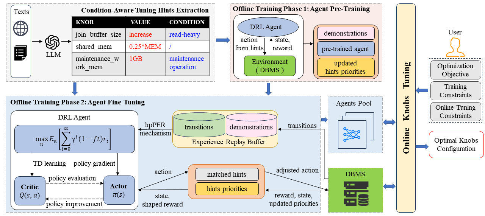

# DemoTuner: Efficient DBMS Knobs Tuning via LLM-Assisted Demonstration Reinforcement Learning
Database systems offer hundreds of parameters that critically impact performance. However, automatic tuning remains challenging due to the vast configuration space and complex parameter interactions. Traditional reinforcement learning (RL) methods suffer from low sample efficiency and slow training, partly due to the lack of guidance during exploration.

DEMOTune is the first approach to bring demonstration learning into database configuration tuning.
By leveraging domain knowledge and high-quality tuning hints, DEMOTune pretrains the agent with high-quality configurations, and later balances domain-guided exploration with self-exploration. This reduces training overhead while improving tuning effectiveness.

Our key contributions:

Knowledge Extraction: Use large language models (LLMs) to mine detailed domain knowledge from expert texts, including parameter recommendations.

Demonstration Learning: Incorporate domain knowledge into the RL agent’s exploration through demonstrations.

Training Enhancements: Apply action-guidance and reward-shaping techniques to speed up and improve training.

We evaluated DEMOTune on MySQL and PostgreSQL under three different workloads.
Results show that DEMOTune significantly outperforms state-of-the-art methods in effectiveness, efficiency, and adaptability.

# start
## Environment Version  
PostgreSQL (16.1)  
MySQL (8.0.36)

## Install dependencies
pip install -r requirements.txt

## Benchmark
The main benchmark we employed for configuration evaluation is YCSB (Yahoo! Cloud Serving Benchmark), which is a frequently used benchmarking tool for performance evaluation of DBMSs. After installation, you need to modify the YCSB installation path in pg.ini or mysql.ini by setting the YCSB_path.

## Main Code
Run `tuning_run.py` with the configuration file path and the `--collect` option to collect and generate demonstration data. Set the YCSB workload type and size in `mysql.ini` or `pg.ini`. Then, run `tuning_run.py` again with the configuration file path and set the training-related options in section `s1` of the `.ini` file to perform offline training.

## Acknowledge
We would like to express our special thanks to the open-source benchmarks, traces and codes of these papers or repositories:

- [YCSB](https://github.com/brianfrankcooper/YCSB)
- [Benchbase](https://github.com/cmu-db/benchbase)

